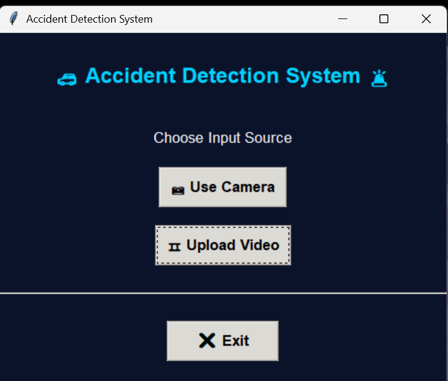
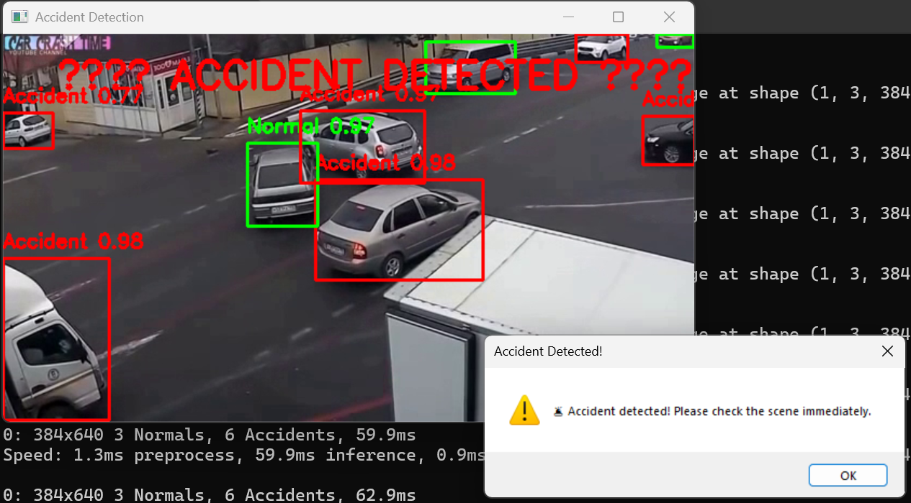
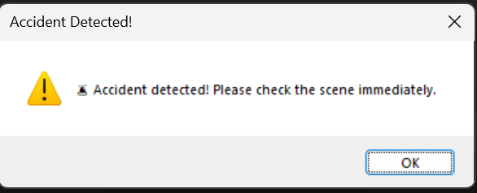

# Real-Time Accident Detection and Notification System

This project implements a real-time accident detection system using computer vision and deep learning.  
It analyzes live camera feeds or uploaded videos to identify accident-prone situations, detect accidents, and generate alert notifications.

---

## Key Features

- GUI-based input selection (Camera or Video Upload)
- Real-time vehicle detection and tracking
- Accident-prone situation identification
- Accident detection with confidence scores
- Visual indication using bounding box colors
- Alert notification after accident detection

---

## Detection Logic (Important)

The system follows a **three-stage logic** for clear interpretation:

### 1. Normal State (Green Bounding Box)
- Vehicles moving normally
- No sudden collision or abnormal behavior
- Marked with **green bounding boxes**

### 2. Accident-Prone State (Red Bounding Box)
- Sudden braking, abnormal vehicle proximity, or irregular motion
- Indicates a **high risk of accident**
- Marked with **red bounding boxes**
- Labeled as *Accident Prone* with confidence score

### 3. Accident Detected (Green Bounding Box)
- Collision or accident has already occurred
- Vehicle status is no longer “prone”
- Bounding box turns **green again**
- Accident alert is triggered
- Popup notification is displayed

> **Note:**  
> Red does **not** mean accident occurred.  
> Red means **accident-prone condition**.  
> After accident confirmation, the box turns green again.

---

## Folder Structure

```text
Real-time_Accident_Detection_and_Notification_System/
├── main.py
├── train.py
├── config.py
├── motion_detector.py
├── video_manager.py
├── alert_manager.py
├── auto_label.py
├── test_camera.py
│
├── dataset/
├── accident_videos/
├── models/
│
├── images/
│   ├── ui_home.png
│   ├── accident_prone.png
│   ├── accident_detected.png
│   └── alert_popup.png
│
├── yolov8n.pt
├── requirements.txt
├── README.md
└── .gitignore
```

## Requirements

- Python 3.8 or higher
- VS Code
- Git
- pip

---

## Setup and Execution

### Step 1: Clone the Repository
```bash
git clone https://github.com/Druva21/Real-time_Accident_Detection_and_Notification_System.git
cd Real-time_Accident_Detection_and_Notification_System
```

---

### Step 2: Create and Activate Virtual Environment
```bash
python -m venv venv
```

**Windows**
```bash
venv\Scripts\activate
```

**Linux / macOS**
```bash
source venv/bin/activate
```

---

### Step 3: Install Dependencies
```bash
pip install -r requirements.txt
```

---

### Step 4: Add Model Weights
Place the YOLO model weights file in the project root directory:
```text
yolov8n.pt
```

---

### Step 5: Run the Application
```bash
python main.py
```

Optional (Training):
```bash
python train.py
```

---

## Output

- Real-time video processing
- Color-coded accident state visualization
- Confidence-based detection
- Instant alert notification

---

## Screenshots





---

## Notes

- Dataset, videos, and trained models are excluded using `.gitignore`
- Virtual environment must be activated before execution
- Model weights are required locally

---

## Author

Druva Kumar Gorla  
Roll No: 2022BCD0018

---

## License

This project is developed for academic and educational purposes only.

